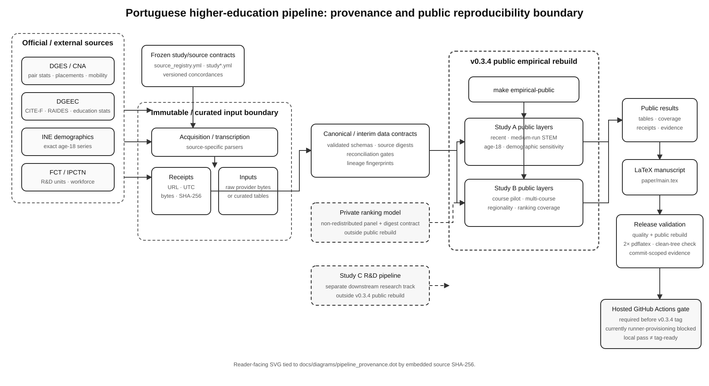

# Pipeline architecture and provenance

This repository is a research data pipeline rather than a service platform. Its architecture is therefore best understood as a provenance graph: official sources are acquired or transcribed under frozen source contracts, bound to receipts and deterministic lineage, transformed into public empirical study layers, and finally rebuilt into manuscript evidence and release validation.



## Public reproducibility boundary

The v0.3.4 public empirical rebuild is intentionally narrower than the full research programme.

`make empirical-public` rebuilds all currently public Study A and Study B empirical layers listed in the Makefile. Those outputs then feed the manuscript build and the local release-candidate validator.

Two important paths sit outside that public rebuild:

- the provider-specific ranking model requires a non-redistributed private ranking panel plus its frozen digest contract;
- Study C is a separate downstream R&D-pipeline research track and is not part of the v0.3.4 public empirical release boundary.

The diagram marks both of these paths explicitly instead of implying that every research result can be reproduced from committed public inputs alone.

## Provenance rules

The main lineage rules are:

- provider bytes are immutable when retained under `data/raw/`;
- every acquisition can be bound to URL, retrieval time, byte size, and SHA-256 receipt metadata;
- curated publication tables are clearly distinguished from provider-byte claims;
- canonical rows preserve exact source digests and deterministic lineage fingerprints;
- duplicated DGES values that should agree are reconciliation gates, not silent overwrite opportunities;
- missing source years remain missing rather than being interpolated into observations;
- historical geography and source vintages are preserved explicitly;
- private/licensed ranking inputs may be digest-bound without being redistributed.

See [`reproducibility.md`](reproducibility.md) for the full provenance contract.

## Release boundary

The release path is:

```text
make empirical-public
        ↓
public Study A + Study B rebuilds
        ↓
LaTeX manuscript build (two passes)
        ↓
make validate-release
        ↓
commit-scoped validation evidence
        ↓
GitHub-hosted CI on the exact release candidate
        ↓
v0.3.4 tag allowed only after hosted execution succeeds
```

The local validator records the exact commit SHA, requires a clean checkout, rebuilds the public empirical layers, runs Ruff, mypy and pytest, compiles the manuscript twice, and checks for tracked-file drift. A local pass does **not** substitute for hosted CI and does **not** make a commit tag-ready by itself.

## Diagram source

The Graphviz source lives at [`diagrams/pipeline_provenance.dot`](diagrams/pipeline_provenance.dot). The committed SVG is the reader-facing representation used by GitHub and documentation readers. The documentation-diagram workflow regenerates the SVG and fails if the committed render drifts from the DOT source.
